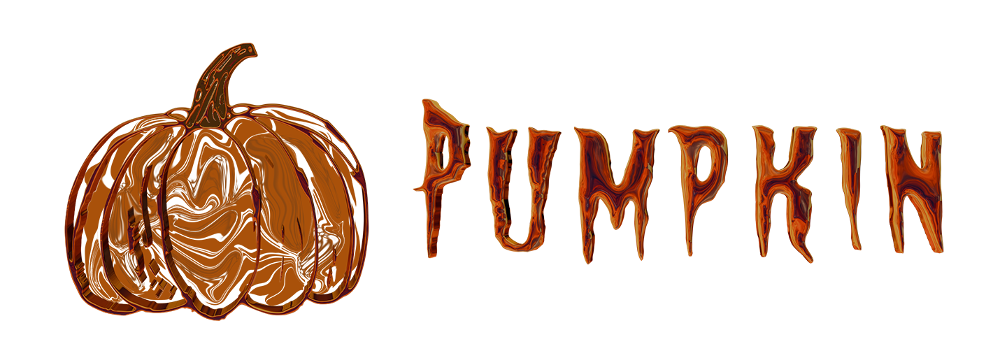

# Pumpkin

Pumpkin is a UI library that wraps Roact and Flipper to achieve better expressiveness and ease of writing components.

Most functionality is implemented in a single file: [Pumpkin](src/Pumpkin/init.lua).

### Main Attractions
* Short Syntax/Builder Pattern
* Bindings class functions exposed and joining made easier
* Flipper (an animation library) is available directly through bindings
* Custom properties (PropSet Modifiers), as opposed to just custom elements
* Props can receive datatype arguments instead of the datatype directly
* Attributes work
* Edit element properties after creation
* Multiple utility/custom properties have already been made like ScaledTextGroup

### Projects
* [Clash!](https://www.roblox.com/games/8256020164/Clash-KNIGHT) 
* [src/example/DebugMenu](src/example/DebugMenu/init.lua)

## Installation
Place the `src/Pumpkin` folder in your project library folder and require it.

## Overview

### Short Syntax/Builder Pattern

```lua
-- Imports (always the same) (will be omitted from the README here on out)
local Pumpkin = require(game.ReplicatedFirst.Pumpkin)
local I, P = Pumpkin, Pumpkin.P

I:ImageButton(P()
	:Center()
	:BackgroundColor3(1, 0, 0)
	:Activated(function()
		print("Clicked!")
	end)
)(
	-- more elements
)

-- Roact 17 and Roact legacy modules are available, just in case
local Roact, RoactRbx = Pumpkin.Roact, Pumpkin.RoactRbx
-- Equivalent to:
Roact.createElement("ImageButton", {
	AnchorPoint = Vector2.new(0.5, 0.5),
	Position = UDim2.fromScale(0.5, 0.5),
	BackgroundColor3 = Color3.new(1, 0, 0),
	[Roact.Event.Activated] = function()
		print("Clicked!")
	end,
}, {
	-- more elements
})
```


### Improved Bindings/Tweens

Bindings provide direct access to their internals, freeing us from having two return vales from `createBinding`
```lua
local pulse, updPulse = I:Binding(0)

-- Equivalent:
updPulse(0.5)
pulse.update(0.5)
```
Also exposed is subscribe
```lua
local disconnect_func = pulse.subscribe(function(newPulseValue) end)
```


When joining bindings, everything goes. Mostly useful for general purpose UI components, we no longer have to check if passed in props are bindings or pure values:
```lua
local pulse = I:Binding(0)
local pulse2 = 0.5

I:JoinBindings({pulse, pulse2}):map(function(table)
	local pulseValue = table[1]		--0
	local pulseValue2 = table[2]	--0.5
end)
```

### PropSet modifiers

Constructing props through the builder pattern lets us put names on our ways of setting props:
```lua
I:Frame(P()
	-- no border and no background
	:Invisible()
	
	-- center anchor and center position
	:Center()
	-- Position it 5 pixels away from the left side of its parent, (overwriting the :Center() call above)
	-- The parameters are interpreted as UDim parameters
	:JustifyLeft(0, 5)
	
	-- Propset modifiers can do a lot more than modify props
	-- This example involves inserting children into the props as well, a UIAspectRatioConstraint
	:AspectRatioProp(1/3)
)
```

Custom modifiers can get pretty advanced, for example we have implemented this:

```lua
I:Frame(P()
	-- Make this frame a 3 pixel line from the top left of the parent to the bottom right
	:Line(UDim2.fromScale(0, 0), UDim2.fromScale(1, 1), 3)
)
```


### Tweens

Pumpkin Tweens are implemented as an extension to bindings and use Flippers UI Animation Library, they start playing when they are attached to an instance, and reset to the beginning when unattached. A tween with no sequences will start playing once sequences have been added to it, which is what you should do if you don't want your tween to play until you tell it to

```lua
-- define a tween with value 0 (default start value)
-- spring to 1 with speed of 2 and damping of 1.3, go back to 0, wait half a second, repeat this forever
local pulse = I:Tween():spring(1, 2, 1.3):instant(0):pause(0.5):repeatAll(-1)

I:ImageButton(P()
	:BackgroundColor3(pulse:map(function(v)-- the tween is a binding with extra functionality.
		return Color3.new(v, 0, 0)
	end))
	:Activated(function()
		pulse:wipe()-- when the buttons is clicked, clear the animation steps and reset to start value (0)
	end)
)
```

So essentially, Pumpkin Tweens are bindings with a sequence of animation steps. As you can see, despite the complex nature of this tween, the syntax remains relatively short. The animation sequence can be defined or changed at any time. You can read more about other functions related to tweens at the top of [Pumpkin](src/Pumpkin/init.lua)

## Shared functionality

Pumpkin provides a way for modules to define shared custom PropSet modifiers, elements, and components. As you'd expect, you can only use shared things after they've been defined.

```lua
--[[ Shared custom modifiers ]]

-- definition
I:RegisterModifier("CustomModifier", function(props, a, b)
	props:AnchorPoint(math.random(), math.random())
	props:Position(0.5, 0, 0.5, 0)
	props:BackgroundTransparency(a - b^2)

	return props
end)

-- use (directly by name)
I:Frame(P()
	:CustomModifier(1, 0.2)
)


--[[ Shared custom elements ]]

-- definition
I:NewElement("MyElement", I:Frame(P()))

I:NewElement("MyElement2", function(props)
	return I:Frame(P())
end)

-- instantiation (directly by name)
I:Element("MyElement", P())
I:Element("MyElement2", P())


--[[ Shared stateful components ]]

-- definition
I:Stateful(P()
	:Name("MyStateful")
	:Init(function(self)
	end)
	:Render(function(self)
	end)
)

-- instantiation (directly by name)
local root = I:Mount(I:MyStateful(P()), game.Players.LocalPlayer.PlayerGui.ScreenGui)
```

For convenience, we made the `ASYNC_DEFINITIONS` flag. It is on by default. It simply causes an undefined Element or field in Pumpkin/PropSets to yield for its definition. After a short timeout, anything still undefined will trigger the expected error, the only difference is that it was delayed. Async definitions can be leveraged with certain frameworks such as Knit to create a "definitions" stage of startup.

## Misc

* More wrappers exist in [Pumpkin](src/Pumpkin/init.lua), such as Refs, Portals, and Change Events.
* Custom Props had to be wrapped: `propSet:Prop(name, value)`.
* [DebugMenu](src/example/DebugMenu/init.lua) for a fully fledged client and server debug menu with sliders, color pickers, plotting, checkboxes, and textboxes.
* Props for host attribute's bindings `:Attribute("AttributeName", value/binding)`.
* The Roact Type table has been exposed: `local isBinding = pulse["$$typeof"] == Roact.Type.Binding`.
* Roact elements fall back to pumpkin prop sets:
	```lua
	Roact.createElement("Frame", {})
		:JustifyLeft(0, 5)
		:Children(
		
		)
	```

* There exists `I:IsPositionInObject`, `I:IsScrollBarAtEnd`.
* `PropSet:ScaledTextGroup` is the better TextScaled that works with multiple TextLabels instead of just one.
* `propSet:Run()` exists to maintain the tree structure of the code by offering in-tree custom modifiers that may be too niche to deserve a full on RegisteredModifier. The classic example is conditionals, without :Run, you may constantly be scrolling up and down leaving the tree to perform logic and then coming back.
	```lua
	-- Conditionally set props without bindings
	local function createFrame(disabled: boolean)
		local props = P():Center()
		
		if disabled then
			props:BackgroundTransparency(0.7)
			props:BackgroundColor3(--[[Some disabled color]])
		else
			props:BackgroundTransparency(0)
			props:BackgroundColor3(--[[Some enabled color]])
		end

		return I:Frame(props)
	end

	-- Now do it without destructuring the tree
	local function createFrame(disabled: boolean)
		return I:Frame(P()
			:Center()
			:Run(function(props)
				if disabled then
					props:BackgroundTransparency(0.7)
					props:BackgroundColor3(--[[Some disabled color]])
				else
					props:BackgroundTransparency(0)
					props:BackgroundColor3(--[[Some enabled color]])
				end
			end)
		)
	end
	```
